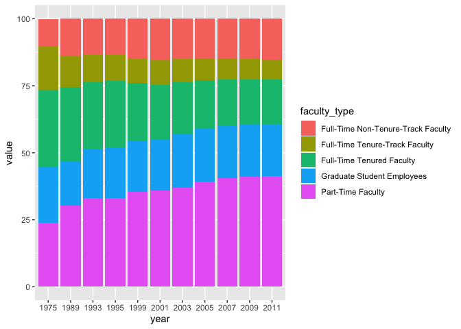
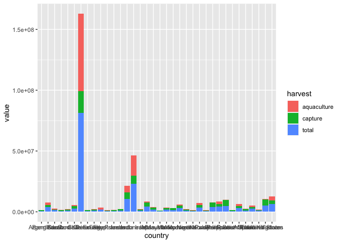
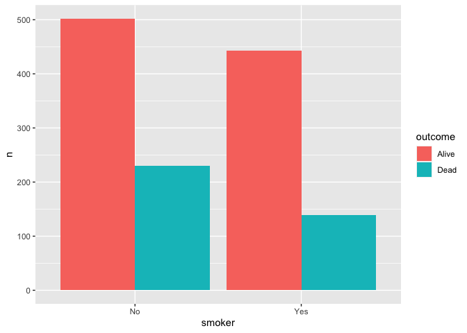
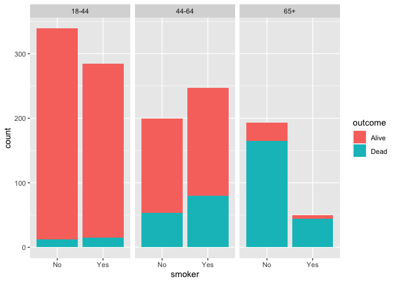

Lab 06 - Ugly charts and Simpson’s paradox
================
Marq Schieber
3/8/2022

### Load packages and data

``` r
library(tidyverse) 
library(mosaicData)
```

### Exercise 1

``` r
staff <- read_csv("data/instructional-staff.csv")
```

    ## Rows: 5 Columns: 12
    ## ── Column specification ────────────────────────────────────────────────────────
    ## Delimiter: ","
    ## chr  (1): faculty_type
    ## dbl (11): 1975, 1989, 1993, 1995, 1999, 2001, 2003, 2005, 2007, 2009, 2011
    ## 
    ## ℹ Use `spec()` to retrieve the full column specification for this data.
    ## ℹ Specify the column types or set `show_col_types = FALSE` to quiet this message.

How many rows will the long-format data have? It will have a row for
each combination of year and faculty type. If there are 5 faculty types
and 11 years of data, how many rows will we have?

Will there be 55 rows?

``` r
staff_long <- staff %>%
  pivot_longer(cols = -faculty_type, names_to = "year") %>%
  mutate(value = as.numeric(value))
```

``` r
staff_long %>%
  ggplot(aes(x = year, y = value, group = faculty_type, color = faculty_type)) +
  geom_line()+
  labs(title = "Trends in Instructional Staff Employment Status, 1975-2011", y = "Percent", x = "Year", color = "Faculty Type")
```

<!-- -->

Suppose the objective of this plot was to show that the proportion of
part-time faculty have gone up over time compared to other instructional
staff types. \> What changes would you propose making to this plot to
tell this story?

I would make the graph a series of collumns, with faculty_type as the
fill.

``` r
staff_long %>% 
  ggplot(aes(x = year, y = value , fill = faculty_type)) +
  geom_col()
```

<!-- -->

### Exercise 2

Can you help them make improve it? First, brainstorm how you would
improve it. Then create the improved visualization and write up the
changes/decisions you made as bullet points. It’s ok if some of your
improvements are aspirational, i.e. you don’t know how to implement it,
but you think it’s a good idea. Ask a tutor for help, but also keep an
eye on the time. Implement what you can and leave note identifying the
aspirational improvements.

I think you would first want to limit which countries as listed on the
graph. Perhaps, those countries that have a total fish of at least
600,000. I think a bar graph that has total count on the Y axis and th
fill consisitng of capture and aquaculture fish would be useful
visually. Furthermore, you could order countries either from greatest to
least or in terms of another measure (i.e. population). It depends on
what you’re trying to show with this presetned information.

``` r
fisheries <- read_csv("data/fisheries.csv")
```

    ## Rows: 216 Columns: 4
    ## ── Column specification ────────────────────────────────────────────────────────
    ## Delimiter: ","
    ## chr (1): country
    ## dbl (3): capture, aquaculture, total
    ## 
    ## ℹ Use `spec()` to retrieve the full column specification for this data.
    ## ℹ Specify the column types or set `show_col_types = FALSE` to quiet this message.

\#got some help from Elayna, but need to ask her again. I think I need
to specifiy what values go into harvest.

``` r
filtered_fisheries<-fisheries %>% 
filter(total>600000)

filtered_fisheries <- filtered_fisheries %>%
  pivot_longer(cols = -country, names_to = "harvest") %>%
  mutate(value = as.numeric(value))

filtered_fisheries %>% 
  ggplot(aes(x = country, y = value, fill = harvest)) +
  geom_col()
```

<!-- -->

### Exercise 3

What type of study do you think these data come from: observational or
experiment? Why?

Observational. Effect of smoking on lifespan. It would be unethical to
assign a ‘potentially’ toxic substance for a longitudinal study.

### Exercise 4

How many observations are in this dataset? What does each observation
represent?

1314 obsercations. Each observation is a person and whether they’re
still alive or not.

### Exercise 5

How many variables are in this dataset? What type of variable is each?
Display each variable using an appropriate visualization.

3 variables. Outcome and smoker are nominal variables. Age is an ordinal
variable.

### Exercise 6

What would you expect the relationship between smoking status and health
outcome to be?

Smokers live shorter lives than non smokers. Higher mortality rate too
probably.

### Exercise 7

Create a visualization depicting the relationship between smoking status
and health outcome. Briefly describe the relationship, and evaluate
whether this meets your expectations. Additionally, calculate the
relevant conditional probabilities to help your narrative. Here is some
code to get you started:

There does not appear to be a relationship between smoking status and
health outcome…Although I think that would change if we were to look at
age of “outcome” aka death.

``` r
Whickham %>%
  count(smoker, outcome) -> count

count %>%
ggplot(aes(x = smoker, y = n, fill = outcome)) +
  geom_bar(stat="identity", position=position_dodge())
```

<!-- -->

``` r
Whickham %>% 
  count(smoker, outcome) %>% 
  group_by(smoker) %>% 
  mutate(Percentage = n / sum(n))
```

    ## # A tibble: 4 × 4
    ## # Groups:   smoker [2]
    ##   smoker outcome     n Percentage
    ##   <fct>  <fct>   <int>      <dbl>
    ## 1 No     Alive     502      0.686
    ## 2 No     Dead      230      0.314
    ## 3 Yes    Alive     443      0.761
    ## 4 Yes    Dead      139      0.239

### Exercise 8

Create a new variable called age_cat using the following scheme: age \<=
44 \~ “18-44” age \> 44 & age \<= 64 \~ “45-64” age \> 64 \~ “65+”

``` r
Whickham <- Whickham %>% 
  mutate(age_cat = case_when(
    age <= 44 ~"18-44",
    age > 44 & age <= 64 ~ "44-64",
    age > 64 ~ "65+"))
```

### Exercise 9

Re-create the visualization depicting the relationship between smoking
status and health outcome, faceted by age_cat. What changed? What might
explain this change? Extend the contingency table from earlier by
breaking it down by age category and use it to help your narrative.

``` r
Whickham %>%
  count(smoker, age_cat, outcome)
```

    ##    smoker age_cat outcome   n
    ## 1      No   18-44   Alive 327
    ## 2      No   18-44    Dead  12
    ## 3      No   44-64   Alive 147
    ## 4      No   44-64    Dead  53
    ## 5      No     65+   Alive  28
    ## 6      No     65+    Dead 165
    ## 7     Yes   18-44   Alive 270
    ## 8     Yes   18-44    Dead  15
    ## 9     Yes   44-64   Alive 167
    ## 10    Yes   44-64    Dead  80
    ## 11    Yes     65+   Alive   6
    ## 12    Yes     65+    Dead  44

``` r
Whickham %>% 
  ggplot(aes(x = smoker, fill = outcome)) +
  geom_bar()+
  facet_wrap(~age_cat)
```

<!-- -->

``` r
Whickham %>% 
  count(smoker, outcome, age_cat) %>% 
  group_by(smoker, age_cat) %>% 
  mutate(Percentage = n / sum(n))
```

    ## # A tibble: 12 × 5
    ## # Groups:   smoker, age_cat [6]
    ##    smoker outcome age_cat     n Percentage
    ##    <fct>  <fct>   <chr>   <int>      <dbl>
    ##  1 No     Alive   18-44     327     0.965 
    ##  2 No     Alive   44-64     147     0.735 
    ##  3 No     Alive   65+        28     0.145 
    ##  4 No     Dead    18-44      12     0.0354
    ##  5 No     Dead    44-64      53     0.265 
    ##  6 No     Dead    65+       165     0.855 
    ##  7 Yes    Alive   18-44     270     0.947 
    ##  8 Yes    Alive   44-64     167     0.676 
    ##  9 Yes    Alive   65+         6     0.12  
    ## 10 Yes    Dead    18-44      15     0.0526
    ## 11 Yes    Dead    44-64      80     0.324 
    ## 12 Yes    Dead    65+        44     0.88

Now when you look at the effect of smoking with age….People who smoke
die at younger ages than those who don’t smoke. This suggests that
smoking decreases people’s lifespans.
